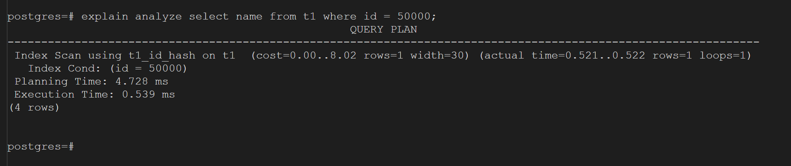
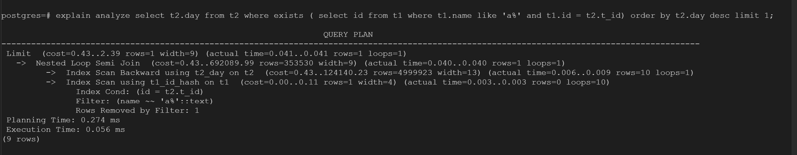
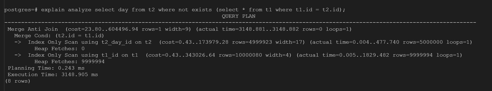

## Задачи

### Задание 1: ускорить простой запроc, добиться времени выполнения < 10ms
``` sql
select name from t1 where id = 50000;
```
### Решение 1:
Чтобы оптимизировать работу этого запроса, я построил хэш-индекс по t1.id.
``` sql
create index t1_id_hash on t1 using hash(id);
```
Хэш-индекс имеет преимущество перед b-tree индексом на операцию равенства(Хэш функция позволяет получать данные за O(1)), поэтому я выбрал его.

Итоговая скорость запроса радует, вот его план запроса:


### Задание 2 ускорить запрос "max + left join", добиться времени выполнения < 10ms
``` sql
select max(t2.day) from t2 left join t1 on t2.t_id = t1.id and t1.name like 'a%';
```
### Решение 2
Использовались следующие индексы.
``` sql
create index t1_id_hash on t1 using hash(id);
create index t2_day on t1 using btree(day);
```
Для оптимизации этого запроса пришлось его переписать, чтобы планировщик принял наиболее оптимальную стратегию выполнения.
Итоговый запрос выглядит вот так:
``` sql
 select t2.day from t2 where exists ( select id from t1 where t1.name like 'a%' and t1.id = t2.t_id) order by t2.day desc limit 1;
```


### Задание 3 ускорить запрос "anti-join", добиться времени выполнения < 10sec
``` sql
select day from t2 where t_id not in ( select t1.id from t1 );
```
### Решение 3
Используемые запросом индексы:
```sql
create index t2_day_id on t2 using btree(id, day);
create index t1_id on t1 using btree(id);
```

Конструкция ```not in``` плохо подходит для больших по обьёму таблиц. Более оптимально использование эквивалентной конструкции ```not exists```.
Обновлённый запрос:
```sql
 select day from t2 where not exists (select * from t1 where t1.id = t2.id);
```


### [4] ускорить запрос "semi-join", добиться времени выполнения < 10sec
``` sql
select day from t2 where t_id in ( select t1.id from t1 where t2.t_id = t1.id) and day > to_char(date_trunc('day',now()- '1 months'::interval),'yyyymmdd');
```